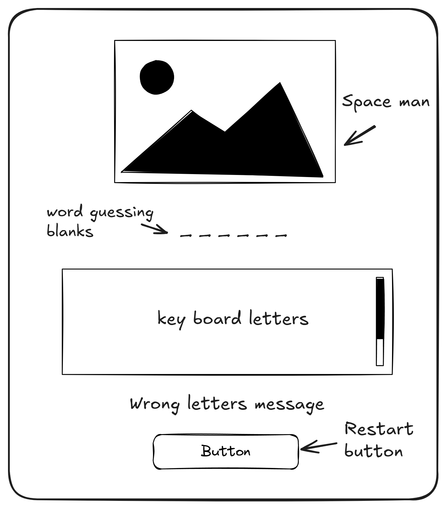

# Spaceman-Game

<!-- {width=300px} -->

- Done by: Khaled Jamal

## Game Description:

Spaceman is game the player guess the word by typing letters from the keyboard within restricted number of tries. To win you need to get the right letters otherwise you will lose. 

## Background info:
I am creating this project as part of my studies at General Assembly's software engineering bootcamp.

The reason I chose to create a snake game as my project is simply because I found the idea to be incredibly fun and intriguing for a beginner's game project, while at the same time allowing for the oppurtunity to learn much of JavaScript's fundamentals along with CSS Grid which I believe will be valuable knowledge for me in the future.

## Getting started
- link of the game
- link of trello 