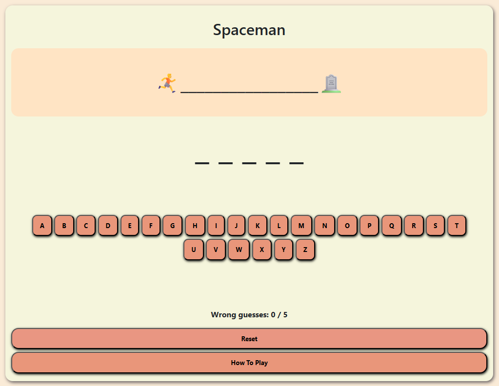

# 🎮 Spaceman-Game

<!-- {width=300px} -->

- Done by: Khaled Jamal

## 📃 Game Description:

Spaceman is a game player guess the word by typing letters from the keyboard within restricted number of tries. To win you need to get the right letters to know the random word otherwise you will lose. 

## 🔎 Background info:
I am creating this project as part of my studies at General Assembly's software engineering bootcamp.

The reason I chose to create a Spaceman game as my project is because I found the idea basic, fun and intriguing for a beginner's game project, and at the same time having the oppurtunity to learn much of JavaScript's fundamentals along with CSS Grid which I believe will be valuable knowledge for me in the future.

## 🧮 Getting started

👉**Play it here** 
- [link of the game](https://k7dbh.github.io/Spaceman-Game/)

👉**Planning Materials:**
- [link of trello](https://trello.com/b/aBFr4aME/spaceman-game) 

### How to play
1. Guess the word:
The computer will choose for you a word randomly and you need to guess it.

2. Number of tries
You have five chances to guess the word by using the keyboard.

3. Win and Lose
-If you get the word spaceman will survive and you will win
-If you missed getting the word spaceman will die and you will lose.

## 💻 Technologies Used

- HTML
- CSS
- JavaScript

## 📚 Attributions

- 

## Next Steps
